# Powerline Sleeve Detection Codebase Analysis

> Note: `__init__.py` files and `build.lib` directories have been excluded from this analysis to focus on core functionality.

## Directory Structure

```
Project Directory Structure:

├── README.md
├── codebase_analysis.md
├── codebase_analyzer.py
├── codebase_flow.html
├── config.yaml
├── hydroone.ipynb
├── output/
│   ├── batch_results/
│   ├── detections/
│   ├── images/
│   ├── logs/
│   │   └── powerline_detector.log
│   ├── maps/
│   └── reports/
├── powerline_sleeve_detection/
│   ├── acquisition/
│   │   ├── cache_manager.py
│   │   ├── image_processor.py
│   │   ├── route_planner.py
│   │   └── streetview_client.py
│   ├── cli.py
│   ├── detection/
│   │   ├── detector.py
│   │   ├── ensemble_integration.py
│   │   ├── model_downloader.py
│   │   ├── model_manager.py
│   │   └── tracker.py
│   ├── main.py
│   ├── processing/
│   │   └── batch_processor.py
│   ├── system/
│   │   ├── config.py
│   │   └── logging.py
│   ├── training/
│   │   ├── README.md
│   │   ├── augmentation.py
│   │   ├── auto_labeling.py
│   │   ├── data_manager.py
│   │   ├── ensemble.py
│   │   ├── evaluate_model.py
│   │   ├── hyperparameter_tuning.py
│   │   ├── monitor.py
│   │   ├── train.py
│   │   ├── train_model.py
│   │   └── trainer.py
│   └── visualization/
│       ├── dashboard.py
│       └── map_generator.py
├── requirements-dev.txt
├── requirements.txt
├── run.py
├── sample_routes.csv
├── setup.py
└── test_system.py
```

## Core Business Logic Flows

### Main Application Workflows

#### Batch Processing

Module: `powerline_sleeve_detection.processing.batch_processor`

Entry Points:

```mermaid
flowchart TD
    procBatch[process_batch_from_csv()] --> loadRoutes[load_routes_from_csv()]
    loadRoutes --> routeCheck{Process in parallel?}
    routeCheck -->|Yes| procParallel[process_routes_parallel()]
    routeCheck -->|No| procSequential[process_routes_sequential()]

    procParallel --> processPool[Create processing pool]
    processPool --> execRoutes[Execute route processing tasks]

    procSequential --> loopRoutes[Loop through routes]
    loopRoutes --> procSingleRoute[process_route()]

    procSingleRoute --> planRoute[Plan route]
    planRoute --> detectSleeves[Detect sleeves]
    detectSleeves --> trackObjects[Track objects]
    trackObjects --> saveResults[Save results]
    saveResults --> generateReport[Generate report]
```

#### Detection

Module: `powerline_sleeve_detection.detection.detector`

Entry Points:
- `detect()`
- `detect_ensemble()`
- `_detect_yolov5()`
- `_detect_yolov8()`
- `_detect_efficientdet()`
- `_ensemble_detections()`
- `batch_detect()`
- `draw_detections()`
- `save_detection_results()`

```mermaid
flowchart TD
    detect[detect()] --> loadModel[Load model if needed]
    loadModel --> modelType{Model type?}
    modelType -->|YOLOv8| detectYolo8[_detect_yolov8()]
    modelType -->|YOLOv5| detectYolo5[_detect_yolov5()]
    modelType -->|EfficientDet| detectEffDet[_detect_efficientdet()]

    detectYolo8 --> processResults[_process_results()]
    detectYolo5 --> processResults
    detectEffDet --> processResults

    batchDetect[batch_detect()] --> useEnsemble{Use ensemble?}
    useEnsemble -->|Yes| detectEnsemble[detect_ensemble()]
    useEnsemble -->|No| detectLoop[Loop through images]
    detectLoop --> detect

    detectEnsemble --> modelIntegration[EnsembleIntegration]
    modelIntegration --> weightedBoxes[weighted_boxes_fusion()]
```


## Module Dependencies

The following diagram shows the dependencies between modules:

```mermaid
flowchart TD
    mod0["codebase_analyzer"]
    mod1["cache_manager"]
    mod2["image_processor"]
    mod3["route_planner"]
    mod4["streetview_client"]
    mod5["cli"]
    mod6["detector"]
    mod7["ensemble_integration"]
    mod8["model_downloader"]
    mod9["model_manager"]
    mod10["tracker"]
    mod11["main"]
    mod12["batch_processor"]
    mod13["config"]
    mod14["logging"]
    mod15["augmentation"]
    mod16["auto_labeling"]
    mod17["data_manager"]
    mod18["ensemble"]
    mod19["evaluate_model"]
    mod20["hyperparameter_tuning"]
    mod21["monitor"]
    mod22["train"]
    mod23["train_model"]
    mod24["trainer"]
    mod25["dashboard"]
    mod26["map_generator"]
    mod27["run"]
    mod28["setup"]
    mod29["test_system"]

    mod1 --> mod14
    mod1 --> mod13
    mod2 --> mod13
    mod2 --> mod14
    mod3 --> mod13
    mod3 --> mod14
    mod4 --> mod13
    mod4 --> mod14
    mod4 --> mod1
    mod5 --> mod14
    mod5 --> mod13
    mod5 --> mod14
    mod5 --> mod12
    mod5 --> mod24
    mod5 --> mod17
    mod5 --> mod15
    mod5 --> mod16
    mod5 --> mod20
    mod5 --> mod21
    mod5 --> mod18
    mod5 --> mod7
    mod5 --> mod14
    mod5 --> mod3
    mod6 --> mod13
    mod6 --> mod14
    mod6 --> mod9
    mod6 --> mod7
    mod7 --> mod14
    mod7 --> mod13
    mod7 --> mod14
    mod7 --> mod9
    mod7 --> mod18
    mod8 --> mod14
    mod8 --> mod13
    mod8 --> mod14
    mod9 --> mod14
    mod9 --> mod13
    mod9 --> mod14
    mod10 --> mod13
    mod10 --> mod14
    mod11 --> mod5
    mod12 --> mod14
    mod12 --> mod13
    mod12 --> mod14
    mod12 --> mod3
    mod12 --> mod4
    mod12 --> mod2
    mod12 --> mod6
    mod12 --> mod9
    mod12 --> mod7
    mod12 --> mod10
    mod12 --> mod26
    mod12 --> mod1
    mod13 --> mod14
    mod14 --> mod14
    mod15 --> mod14
    mod16 --> mod14
    mod16 --> mod13
    mod17 --> mod14
    mod17 --> mod13
    mod18 --> mod14
    mod18 --> mod13
    mod19 --> mod14
    mod19 --> mod13
    mod19 --> mod14
    mod19 --> mod18
    mod19 --> mod21
    mod20 --> mod14
    mod20 --> mod13
    mod20 --> mod24
    mod21 --> mod14
    mod22 --> mod13
    mod22 --> mod14
    mod22 --> mod14
    mod22 --> mod23
    mod22 --> mod19
    mod23 --> mod14
    mod23 --> mod13
    mod23 --> mod14
    mod23 --> mod24
    mod23 --> mod17
    mod23 --> mod15
    mod23 --> mod20
    mod23 --> mod16
    mod23 --> mod18
    mod23 --> mod21
    mod24 --> mod14
    mod24 --> mod13
    mod25 --> mod13
    mod25 --> mod14
    mod26 --> mod13
    mod26 --> mod14
    mod27 --> mod5
    mod29 --> mod13
    mod29 --> mod14
```




## Function Analysis

```
Function Flow Analysis:

Modules and Defined Functions:
  codebase_analyzer:
    - __init__
    - _analyze_file
    - _analyze_python_files
    - _generate_cli_workflow
    - _generate_detection_workflow
    - _generate_evaluation_workflow
    - _generate_processing_workflow
    - _generate_training_workflow
    - _scan_directory_structure
    - analyze
    - extract_core_workflow
    - generate_ascii_graph
    - generate_directory_tree
    - generate_function_flow
    - generate_mermaid_diagram
    - generate_report
    - generate_visualization
    - main
    - print_tree
    - scan_dir
  powerline_sleeve_detection.acquisition.cache_manager:
    - __init__
    - _cleanup_cache
    - _compute_cache_key
    - _enforce_size_limit
    - _init_cache_dirs
    - _load_metadata
    - _remove_cache_entry
    - _save_metadata
    - cached
    - clear
    - decorator
    - get
    - get_stats
    - set
    - wrapper
  powerline_sleeve_detection.acquisition.image_processor:
    - __init__
    - _enhance_image
    - batch_process_images
    - create_augmented_images
    - preprocess_image
    - save_processed_images
  powerline_sleeve_detection.acquisition.route_planner:
    - __init__
    - apply_adaptive_sampling
    - calculate_bearing
    - calculate_powerline_points
    - calculate_route_bearings
    - calculate_segment_importance
    - get_route_coordinates
    - haversine
    - interpolate_route
    - plan_route
  powerline_sleeve_detection.acquisition.streetview_client:
    - __init__
    - _get_params_for_index
    - save_images
  powerline_sleeve_detection.cli:
    - augment_dataset
    - auto_label_images
    - create_empty_dataset
    - create_ensemble
    - evaluate_ensemble
    - initialize_config
    - load_config
    - main
    - plan_command
    - prepare_dataset
    - process_command
    - semi_supervised_labeling
    - setup_environment
    - train_command
    - train_model
    - tune_hyperparameters
  powerline_sleeve_detection.detection.detector:
    - __init__
    - _apply_nms
    - _detect_efficientdet
    - _detect_yolov5
    - _detect_yolov8
    - _ensemble_detections
    - _estimate_optimal_batch_size
    - _process_results
    - batch_detect
    - detect
    - detect_ensemble
    - draw_detections
    - save_detection_results
  powerline_sleeve_detection.detection.ensemble_integration:
    - __init__
    - _convert_ensemble_results
    - _init_ensemble_detector
    - detect_with_ensemble
    - enhanced_detect_ensemble
    - integrate_with_detector
  powerline_sleeve_detection.detection.model_downloader:
    - __init__
    - check_and_download_missing_models
    - download_all_available_models
    - download_file
    - download_from_config
    - download_models
    - download_pretrained_models
    - get_pretrained_model_url
    - list_available_models
    - list_downloaded_models
    - main
    - verify_file_hash
  powerline_sleeve_detection.detection.model_manager:
    - __init__
    - _actually_load_efficientdet_model
    - _actually_load_yolov5_model
    - _actually_load_yolov8_model
    - _download_model
    - _get_device
    - _manage_loaded_models
    - get_ensemble_models
    - get_model
    - get_model_status
    - load_model
    - load_models
    - register_models
    - unload_model
  powerline_sleeve_detection.detection.tracker:
    - __init__
    - _calculate_iou
    - _generate_object_id
    - get_geo_dataframe
    - get_statistics
    - mark_disappeared
    - process_batch_results
    - save_to_csv
    - update
    - update
  powerline_sleeve_detection.main:
  powerline_sleeve_detection.processing.batch_processor:
    - __init__
    - _generate_batch_summary
    - create_route_subset_for_validation
    - export_combined_results
    - load_routes_from_csv
  powerline_sleeve_detection.system.config:
    - __post_init__
    - _apply_environment_variables
    - _get_logger
    - check_for_updates
    - create_output_dirs
    - from_dict
    - from_yaml
    - save
    - to_dict
    - validate
  powerline_sleeve_detection.system.logging:
    - get_logger
    - process
    - setup_logging
  powerline_sleeve_detection.training.augmentation:
    - __init__
    - _create_transform
    - _draw_bboxes
    - _read_yolo_labels
    - _write_yolo_labels
    - augment_dataset
    - preview_augmentations
  powerline_sleeve_detection.training.auto_labeling:
    - __init__
    - _write_detections_to_file
    - label_images
    - load_model
    - semi_supervised_labeling
    - visualize_labels
  powerline_sleeve_detection.training.data_manager:
    - __init__
    - _convert_to_single_class
    - _copy_files
    - _create_dataset_yaml
    - _detect_class_names
    - _match_images_with_labels
    - create_empty_dataset
    - prepare_dataset
  powerline_sleeve_detection.training.ensemble:
    - __init__
    - _calculate_iou
    - _draw_predictions
    - _load_yolo_labels
    - _match_detections
    - _nms
    - _non_maximum_suppression
    - _weighted_boxes_fusion
    - add_model
    - evaluate_ensemble
    - load_models_from_config
    - predict
  powerline_sleeve_detection.training.evaluate_model:
    - calculate_iou
    - compare_models
    - create_comparison_report
    - create_metric_plots
    - evaluate_ensemble
    - evaluate_on_test_dir
    - evaluate_single_model
    - evaluate_with_yolo_val
    - load_yolo_labels
    - main
    - match_predictions_to_ground_truth
    - parse_args
    - save_detection_visualization
  powerline_sleeve_detection.training.hyperparameter_tuning:
    - __init__
    - _objective
    - _sample_parameters
    - _save_best_params
    - _save_trial_results
    - apply_best_params
    - run_study
  powerline_sleeve_detection.training.monitor:
    - __init__
    - compare_models
    - create_metrics_table
    - create_training_summary
    - load_results
    - plot_confusion_matrix
    - plot_metrics
  powerline_sleeve_detection.training.train:
    - load_config
    - main
    - parse_args
    - run_evaluate_command
    - run_train_command
  powerline_sleeve_detection.training.train_model:
    - augment_dataset
    - auto_label_images
    - create_ensemble
    - main
    - parse_args
    - prepare_dataset
    - run_full_workflow
    - train_model
    - tune_hyperparameters
  powerline_sleeve_detection.training.trainer:
    - __init__
    - export_model
    - initialize_model
    - train
    - validate
  powerline_sleeve_detection.visualization.dashboard:
    - __init__
    - _create_callbacks
    - _create_layout
    - create_app
    - generate_standalone_html
    - load_dashboard_data
    - load_data
    - open_browser
    - save_dashboard_data
    - start_dashboard
    - update_confidence_histogram
    - update_coverage_map
    - update_detection_map
    - update_detections_by_location
    - update_detections_timeline
  powerline_sleeve_detection.visualization.map_generator:
    - __init__
    - _calculate_visible_range
    - _haversine_distance
    - add_coverage_polygons
    - add_coverage_stats
    - add_detection_markers
    - add_image_points
    - add_route_line
    - calculate_route_coverage
    - create_base_map
    - export_geojson
    - generate_detection_heatmap
    - generate_map
  run:
  setup:
  test_system:
    - run_tests
    - test_config
    - test_directories
    - test_logging

Module Dependencies:
  codebase_analyzer imports:
    - ast
    - json
    - networkx
    - os
    - pathlib
    - plotly.graph_objects
    - re
    - sys
    - typing
  powerline_sleeve_detection.acquisition.cache_manager imports:
    - PIL
    - hashlib
    - io
    - json
    - logging
    - os
    - pickle
    - shutil
    - system.config
    - time
    - typing
  powerline_sleeve_detection.acquisition.image_processor imports:
    - PIL
    - concurrent.futures
    - cv2
    - numpy
    - os
    - system.config
    - system.logging
    - time
    - typing
  powerline_sleeve_detection.acquisition.route_planner imports:
    - geopy.distance
    - math
    - numpy
    - polyline
    - pyproj
    - requests
    - system.config
    - system.logging
    - time
    - typing
  powerline_sleeve_detection.acquisition.streetview_client imports:
    - PIL
    - aiohttp
    - asyncio
    - cache_manager
    - io
    - json
    - numpy
    - os
    - system.config
    - system.logging
    - time
    - typing
  powerline_sleeve_detection.cli imports:
    - argparse
    - asyncio
    - detection.ensemble_integration
    - dotenv
    - json
    - logging
    - os
    - pathlib
    - powerline_sleeve_detection.acquisition.route_planner
    - powerline_sleeve_detection.system.logging
    - processing.batch_processor
    - subprocess
    - sys
    - system.config
    - system.logging
    - traceback
    - training.augmentation
    - training.auto_labeling
    - training.data_manager
    - training.ensemble
    - training.hyperparameter_tuning
    - training.monitor
    - training.trainer
    - typing
    - yaml
  powerline_sleeve_detection.detection.detector imports:
    - PIL
    - concurrent.futures
    - cv2
    - ensemble_integration
    - gc
    - model_manager
    - numpy
    - os
    - system.config
    - system.logging
    - time
    - torch
    - torch.nn.functional
    - typing
  powerline_sleeve_detection.detection.ensemble_integration imports:
    - PIL
    - __future__
    - logging
    - model_manager
    - numpy
    - os
    - pathlib
    - system.config
    - system.logging
    - torch
    - training.ensemble
    - typing
  powerline_sleeve_detection.detection.model_downloader imports:
    - argparse
    - hashlib
    - json
    - logging
    - os
    - requests
    - sys
    - system.config
    - system.logging
    - time
    - tqdm
    - typing
    - yaml
  powerline_sleeve_detection.detection.model_manager imports:
    - effdet
    - gc
    - logging
    - os
    - requests
    - shutil
    - system.config
    - system.logging
    - time
    - torch
    - tqdm
    - typing
    - ultralytics
  powerline_sleeve_detection.detection.tracker imports:
    - collections
    - dataclasses
    - geopandas
    - numpy
    - pandas
    - shapely.geometry
    - system.config
    - system.logging
    - time
    - typing
    - uuid
  powerline_sleeve_detection.main imports:
    - cli
    - dotenv
    - os
    - sys
  powerline_sleeve_detection.processing.batch_processor imports:
    - acquisition.cache_manager
    - acquisition.image_processor
    - acquisition.route_planner
    - acquisition.streetview_client
    - asyncio
    - concurrent.futures
    - csv
    - datetime
    - detection.detector
    - detection.ensemble_integration
    - detection.model_manager
    - detection.tracker
    - geopandas
    - json
    - logging
    - os
    - pandas
    - random
    - shapely.geometry
    - system.config
    - system.logging
    - time
    - typing
    - visualization.map_generator
  powerline_sleeve_detection.system.config imports:
    - dataclasses
    - dotenv
    - json
    - logging
    - os
    - time
    - typing
    - yaml
  powerline_sleeve_detection.system.logging imports:
    - logging
    - logging.handlers
    - os
    - sys
    - typing
  powerline_sleeve_detection.training.augmentation imports:
    - albumentations
    - cv2
    - logging
    - numpy
    - os
    - pathlib
    - random
    - tqdm
    - typing
  powerline_sleeve_detection.training.auto_labeling imports:
    - cv2
    - logging
    - numpy
    - os
    - pathlib
    - powerline_sleeve_detection.system.config
    - shutil
    - shutil
    - shutil
    - torch
    - tqdm
    - typing
    - ultralytics
  powerline_sleeve_detection.training.data_manager imports:
    - logging
    - numpy
    - os
    - pathlib
    - powerline_sleeve_detection.system.config
    - random
    - shutil
    - sklearn.model_selection
    - typing
    - yaml
  powerline_sleeve_detection.training.ensemble imports:
    - cv2
    - logging
    - numpy
    - os
    - pathlib
    - powerline_sleeve_detection.system.config
    - torch
    - tqdm
    - typing
    - ultralytics
  powerline_sleeve_detection.training.evaluate_model imports:
    - argparse
    - cv2
    - cv2
    - ensemble
    - json
    - json
    - json
    - logging
    - matplotlib.pyplot
    - monitor
    - numpy
    - os
    - pandas
    - pathlib
    - sys
    - system.config
    - system.logging
    - torch
    - tqdm
    - typing
    - ultralytics
    - yaml
  powerline_sleeve_detection.training.hyperparameter_tuning imports:
    - json
    - logging
    - numpy
    - optuna
    - optuna.samplers
    - optuna.trial
    - os
    - pathlib
    - powerline_sleeve_detection.system.config
    - powerline_sleeve_detection.training.trainer
    - torch
    - typing
    - yaml
  powerline_sleeve_detection.training.monitor imports:
    - json
    - logging
    - matplotlib.figure
    - matplotlib.pyplot
    - numpy
    - os
    - pandas
    - pathlib
    - seaborn
    - typing
  powerline_sleeve_detection.training.train imports:
    - argparse
    - importlib
    - logging
    - os
    - pathlib
    - powerline_sleeve_detection.system.config
    - powerline_sleeve_detection.system.logging
    - powerline_sleeve_detection.training.evaluate_model
    - powerline_sleeve_detection.training.train_model
    - sys
    - yaml
  powerline_sleeve_detection.training.train_model imports:
    - argparse
    - augmentation
    - auto_labeling
    - data_manager
    - ensemble
    - hyperparameter_tuning
    - logging
    - monitor
    - os
    - pathlib
    - sys
    - system.config
    - system.logging
    - torch
    - tqdm
    - trainer
    - typing
    - yaml
  powerline_sleeve_detection.training.trainer imports:
    - logging
    - os
    - pathlib
    - powerline_sleeve_detection.system.config
    - torch
    - typing
    - ultralytics
    - yaml
  powerline_sleeve_detection.visualization.dashboard imports:
    - dash
    - dash
    - dash.dependencies
    - dash_bootstrap_components
    - datetime
    - json
    - matplotlib.pyplot
    - numpy
    - os
    - pandas
    - plotly.express
    - plotly.graph_objects
    - plotly.subplots
    - seaborn
    - system.config
    - system.logging
    - threading
    - time
    - typing
    - webbrowser
  powerline_sleeve_detection.visualization.map_generator imports:
    - PIL
    - base64
    - contextily
    - folium
    - geopandas
    - io
    - json
    - math
    - matplotlib.colors
    - matplotlib.pyplot
    - numpy
    - os
    - pandas
    - shapely.geometry
    - system.config
    - system.logging
    - time
    - typing
  run imports:
    - dotenv
    - powerline_sleeve_detection.cli
    - sys
  setup imports:
    - setuptools
  test_system imports:
    - argparse
    - os
    - powerline_sleeve_detection.system.config
    - powerline_sleeve_detection.system.logging
    - sys

Function Calls:
  In codebase_analyzer:
    - CodebaseAnalyzer (called 1 times)
    - G.add_edge (called 1 times)
    - G.add_node (called 1 times)
    - G.edges (called 1 times)
    - G.nodes (called 1 times)
    - Path (called 1 times)
    - adjacency.items (called 1 times)
    - adjacency.keys (called 1 times)
    - analyzer.analyze (called 1 times)
    - analyzer.generate_report (called 1 times)
    - any (called 6 times)
    - ast.parse (called 1 times)
    - ast.walk (called 3 times)
    - call_counts.get (called 1 times)
    - call_counts.items (called 1 times)
    - dict (called 6 times)
    - edge_x.extend (called 1 times)
    - edge_y.extend (called 1 times)
    - entry_points.items (called 1 times)
    - enumerate (called 4 times)
    - f.endswith (called 1 times)
    - f.read (called 1 times)
    - f.write (called 25 times)
    - fig.write_html (called 1 times)
    - file.endswith (called 1 times)
    - function_calls.append (called 2 times)
    - functions.append (called 1 times)
    - go.Figure (called 1 times)
    - go.Layout (called 1 times)
    - go.Scatter (called 2 times)
    - isinstance (called 7 times)
    - item.endswith (called 1 times)
    - item.startswith (called 1 times)
    - len (called 5 times)
    - list (called 1 times)
    - main (called 1 times)
    - module.split (called 2 times)
    - module_imports.append (called 2 times)
    - node_x.append (called 1 times)
    - node_y.append (called 1 times)
    - nx.DiGraph (called 1 times)
    - nx.spring_layout (called 1 times)
    - open (called 2 times)
    - os.listdir (called 1 times)
    - os.walk (called 1 times)
    - output.append (called 31 times)
    - output.extend (called 1 times)
    - potential_match.endswith (called 3 times)
    - print (called 5 times)
    - print_tree (called 2 times)
    - rel_path.replace (called 1 times)
    - scan_dir (called 2 times)
    - self._analyze_file (called 1 times)
    - self._analyze_python_files (called 1 times)
    - self._generate_cli_workflow (called 1 times)
    - self._generate_detection_workflow (called 1 times)
    - self._generate_evaluation_workflow (called 1 times)
    - self._generate_processing_workflow (called 1 times)
    - self._generate_training_workflow (called 1 times)
    - self._scan_directory_structure (called 1 times)
    - self.extract_core_workflow (called 1 times)
    - self.generate_ascii_graph (called 1 times)
    - self.generate_directory_tree (called 1 times)
    - self.generate_function_flow (called 1 times)
    - self.generate_mermaid_diagram (called 1 times)
    - self.generate_visualization (called 1 times)
    - sorted (called 14 times)
    - structure.items (called 1 times)
    - structure.update (called 1 times)
    - sum (called 2 times)
    - text.append (called 1 times)
  In powerline_sleeve_detection.acquisition.cache_manager:
    - BytesIO (called 1 times)
    - Image.open (called 1 times)
    - TypeVar (called 1 times)
    - entries_by_time.append (called 1 times)
    - entries_by_time.sort (called 1 times)
    - expired_keys.append (called 1 times)
    - f.read (called 1 times)
    - func (called 2 times)
    - hashlib.md5 (called 2 times)
    - isinstance (called 4 times)
    - json.dump (called 2 times)
    - json.dumps (called 1 times)
    - json.load (called 2 times)
    - keys_to_remove.append (called 1 times)
    - len (called 4 times)
    - logging.getLogger (called 1 times)
    - metadata.get (called 8 times)
    - open (called 7 times)
    - os.makedirs (called 6 times)
    - os.remove (called 1 times)
    - pickle.dump (called 1 times)
    - pickle.dumps (called 1 times)
    - pickle.load (called 1 times)
    - self._cleanup_cache (called 1 times)
    - self._compute_cache_key (called 2 times)
    - self._enforce_size_limit (called 1 times)
    - self._init_cache_dirs (called 1 times)
    - self._load_metadata (called 1 times)
    - self._remove_cache_entry (called 4 times)
    - self._save_metadata (called 3 times)
    - self.get (called 1 times)
    - self.set (called 1 times)
    - serialized.encode (called 1 times)
    - shutil.rmtree (called 1 times)
    - str (called 1 times)
    - time.time (called 3 times)
    - value.save (called 1 times)
  In powerline_sleeve_detection.acquisition.image_processor:
    - Image.fromarray (called 1 times)
    - ImageEnhance.Brightness (called 1 times)
    - ImageEnhance.Color (called 1 times)
    - ImageEnhance.Contrast (called 1 times)
    - ImageFilter.GaussianBlur (called 1 times)
    - ThreadPoolExecutor (called 1 times)
    - augmented_images.append (called 4 times)
    - augmented_results.extend (called 1 times)
    - clahe.apply (called 1 times)
    - cv2.Canny (called 1 times)
    - cv2.addWeighted (called 1 times)
    - cv2.createCLAHE (called 1 times)
    - cv2.cvtColor (called 4 times)
    - cv2.fastNlMeansDenoisingColored (called 1 times)
    - enumerate (called 2 times)
    - executor.submit (called 1 times)
    - failed_images.append (called 1 times)
    - future.result (called 1 times)
    - get_logger (called 1 times)
    - image.filter (called 1 times)
    - img.get (called 5 times)
    - int (called 6 times)
    - len (called 14 times)
    - np.array (called 1 times)
    - os.makedirs (called 2 times)
    - params.copy (called 4 times)
    - params.get (called 10 times)
    - processed_results.append (called 1 times)
    - processing_results.get (called 2 times)
    - result.get (called 10 times)
    - self._enhance_image (called 1 times)
    - self.create_augmented_images (called 1 times)
    - time.time (called 2 times)
  In powerline_sleeve_detection.acquisition.route_planner:
    - Geod (called 1 times)
    - bearings.append (called 2 times)
    - bearings.extend (called 1 times)
    - coordinates.extend (called 1 times)
    - data.get (called 1 times)
    - enhanced_points.append (called 3 times)
    - enumerate (called 1 times)
    - get_logger (called 1 times)
    - int (called 2 times)
    - len (called 25 times)
    - map (called 2 times)
    - math.asin (called 1 times)
    - math.atan2 (called 1 times)
    - math.cos (called 6 times)
    - math.degrees (called 1 times)
    - math.sin (called 5 times)
    - math.sqrt (called 1 times)
    - max (called 1 times)
    - min (called 2 times)
    - new_points.append (called 2 times)
    - polyline.decode (called 1 times)
    - powerline_points.extend (called 1 times)
    - range (called 6 times)
    - requests.get (called 1 times)
    - response.json (called 1 times)
    - response.raise_for_status (called 1 times)
    - self.apply_adaptive_sampling (called 1 times)
    - self.calculate_bearing (called 2 times)
    - self.calculate_powerline_points (called 1 times)
    - self.calculate_route_bearings (called 1 times)
    - self.calculate_segment_importance (called 1 times)
    - self.get_route_coordinates (called 1 times)
    - self.haversine (called 2 times)
    - self.interpolate_route (called 2 times)
    - side_points.append (called 1 times)
    - time.sleep (called 1 times)
  In powerline_sleeve_detection.acquisition.streetview_client:
    - BytesIO (called 1 times)
    - CacheManager (called 1 times)
    - Image.open (called 1 times)
    - aiohttp.ClientSession (called 1 times)
    - all_images.extend (called 2 times)
    - asyncio.Lock (called 1 times)
    - asyncio.gather (called 1 times)
    - asyncio.sleep (called 3 times)
    - enumerate (called 3 times)
    - f.get (called 1 times)
    - get_logger (called 1 times)
    - image_results.get (called 1 times)
    - int (called 3 times)
    - isinstance (called 1 times)
    - len (called 14 times)
    - os.makedirs (called 1 times)
    - params.get (called 5 times)
    - range (called 1 times)
    - response.read (called 1 times)
    - response.text (called 1 times)
    - result.get (called 5 times)
    - route_data.get (called 1 times)
    - saved_files.append (called 1 times)
    - self._apply_rate_limiting (called 1 times)
    - self._get_params_for_index (called 1 times)
    - self.get_streetview_image (called 1 times)
    - self.get_streetview_images (called 2 times)
    - self.initialize (called 2 times)
    - sum (called 2 times)
    - tasks.append (called 1 times)
    - time.time (called 2 times)
    - valid_results.append (called 2 times)
  In powerline_sleeve_detection.cli:
    - AugmentationPipeline (called 1 times)
    - AutoLabeler (called 2 times)
    - BatchProcessor (called 3 times)
    - Config.from_dict (called 1 times)
    - Config.from_yaml (called 1 times)
    - Config.get_instance (called 2 times)
    - DataManager (called 2 times)
    - EnsembleDetector (called 2 times)
    - HyperparameterTuner (called 1 times)
    - RoutePlanner (called 1 times)
    - SleeveModelTrainer (called 1 times)
    - additional_params.append (called 1 times)
    - additional_params.extend (called 1 times)
    - argparse.ArgumentParser (called 1 times)
    - augmenter.augment_dataset (called 1 times)
    - auto_labeler.label_images (called 1 times)
    - auto_labeler.load_model (called 2 times)
    - auto_labeler.semi_supervised_labeling (called 1 times)
    - auto_labeler.visualize_labels (called 1 times)
    - class_mapping.split (called 1 times)
    - class_names.split (called 2 times)
    - cmd.append (called 2 times)
    - cmd.extend (called 14 times)
    - config.create_output_dirs (called 1 times)
    - config.get (called 2 times)
    - config.set (called 14 times)
    - config.to_yaml_str (called 1 times)
    - config.validate (called 1 times)
    - data_manager.create_empty_dataset (called 1 times)
    - data_manager.prepare_dataset (called 1 times)
    - ensemble.evaluate_ensemble (called 1 times)
    - ensemble.load_models_from_config (called 2 times)
    - ensemble_config.append (called 1 times)
    - f.write (called 1 times)
    - initialize_config (called 1 times)
    - item.split (called 1 times)
    - len (called 9 times)
    - list (called 1 times)
    - load_dotenv (called 1 times)
    - logger.error (called 13 times)
    - logger.info (called 27 times)
    - logging.error (called 6 times)
    - logging.getLogger (called 3 times)
    - logging.info (called 4 times)
    - main (called 1 times)
    - map (called 2 times)
    - model_paths.split (called 1 times)
    - model_paths_flat.extend (called 2 times)
    - model_weights.split (called 1 times)
    - open (called 2 times)
    - os.makedirs (called 2 times)
    - pair.split (called 1 times)
    - parser.add_subparsers (called 1 times)
    - parser.parse_args (called 1 times)
    - parser.print_help (called 1 times)
    - plan_command (called 1 times)
    - plan_parser.add_argument (called 3 times)
    - planner.plan_route (called 1 times)
    - planner.plan_routes_from_csv (called 1 times)
    - print (called 69 times)
    - process_command (called 1 times)
    - process_parser.add_argument (called 8 times)
    - processor.process_batch_from_csv (called 2 times)
    - processor.process_route (called 2 times)
    - processor.process_videos_from_csv (called 1 times)
    - result.get (called 17 times)
    - results.get (called 1 times)
    - setup_logging (called 4 times)
    - str (called 2 times)
    - subparsers.add_parser (called 3 times)
    - subprocess.run (called 1 times)
    - sum (called 2 times)
    - sys.exit (called 14 times)
    - traceback.print_exc (called 3 times)
    - train_command (called 1 times)
    - train_parser.add_argument (called 10 times)
    - trainer.initialize_model (called 1 times)
    - trainer.train (called 1 times)
    - trainer.validate (called 1 times)
    - tuner.apply_best_params (called 1 times)
    - tuner.run_study (called 1 times)
    - tuple (called 1 times)
    - yaml.safe_load (called 1 times)
    - zip (called 1 times)
  In powerline_sleeve_detection.detection.detector:
    - EnsembleIntegration (called 1 times)
    - F.interpolate (called 1 times)
    - ImageDraw.Draw (called 1 times)
    - ModelManager (called 1 times)
    - ThreadPoolExecutor (called 1 times)
    - batch_results.get (called 2 times)
    - combined_detections.append (called 1 times)
    - config.get (called 1 times)
    - d.get (called 1 times)
    - detection_results.append (called 3 times)
    - detections.append (called 3 times)
    - draw.rectangle (called 1 times)
    - draw.text (called 1 times)
    - enumerate (called 2 times)
    - executor.submit (called 2 times)
    - final_detections.sort (called 1 times)
    - float (called 19 times)
    - future.result (called 1 times)
    - futures.append (called 1 times)
    - get_logger (called 1 times)
    - image.copy (called 1 times)
    - image.getbands (called 1 times)
    - image.tobytes (called 1 times)
    - img_dict.get (called 3 times)
    - img_draw.save (called 1 times)
    - img_tensor.permute (called 1 times)
    - img_tensor.to (called 1 times)
    - img_tensor.unsqueeze (called 1 times)
    - img_tensor.view (called 1 times)
    - int (called 6 times)
    - invalid_images.append (called 6 times)
    - keep.append (called 1 times)
    - len (called 18 times)
    - map (called 1 times)
    - max (called 2 times)
    - min (called 2 times)
    - model (called 3 times)
    - model_results.append (called 1 times)
    - np.array (called 3 times)
    - np.maximum (called 4 times)
    - np.minimum (called 2 times)
    - np.where (called 1 times)
    - os.makedirs (called 2 times)
    - params.get (called 5 times)
    - processed.get (called 2 times)
    - range (called 2 times)
    - result_tensor.cpu (called 1 times)
    - saved_files.append (called 1 times)
    - scores.argsort (called 1 times)
    - self._apply_nms (called 1 times)
    - self._detect_efficientdet (called 1 times)
    - self._detect_yolov5 (called 1 times)
    - self._detect_yolov8 (called 1 times)
    - self._ensemble_detections (called 1 times)
    - self._estimate_optimal_batch_size (called 1 times)
    - self._process_results (called 1 times)
    - self.detect (called 3 times)
    - self.detect_ensemble (called 2 times)
    - self.draw_detections (called 1 times)
    - str (called 3 times)
    - sum (called 1 times)
    - time.time (called 9 times)
    - torch.ByteTensor (called 1 times)
    - torch.no_grad (called 1 times)
  In powerline_sleeve_detection.detection.ensemble_integration:
    - EnsembleDetector (called 1 times)
    - Path (called 1 times)
    - config.get (called 1 times)
    - detections.append (called 1 times)
    - enumerate (called 1 times)
    - float (called 1 times)
    - get_logger (called 1 times)
    - image.save (called 1 times)
    - int (called 1 times)
    - locals (called 1 times)
    - map (called 1 times)
    - original_ensemble_method (called 1 times)
    - self._convert_ensemble_results (called 1 times)
    - self._init_ensemble_detector (called 1 times)
    - self.detect_with_ensemble (called 1 times)
    - str (called 1 times)
    - temp_dir.mkdir (called 1 times)
    - temp_path.exists (called 1 times)
    - temp_path.unlink (called 1 times)
    - zip (called 1 times)
  In powerline_sleeve_detection.detection.model_downloader:
    - Config (called 1 times)
    - Config.from_yaml (called 1 times)
    - ModelDownloader (called 1 times)
    - argparse.ArgumentParser (called 1 times)
    - bar.update (called 1 times)
    - downloader.check_and_download_missing_models (called 1 times)
    - downloader.download_all_available_models (called 1 times)
    - downloader.download_model (called 1 times)
    - downloader.list_available_models (called 1 times)
    - downloader.list_downloaded_models (called 1 times)
    - f.read (called 1 times)
    - f.write (called 1 times)
    - get_logger (called 1 times)
    - getattr (called 1 times)
    - hash_func.hexdigest (called 1 times)
    - hash_func.update (called 1 times)
    - int (called 1 times)
    - iter (called 1 times)
    - len (called 3 times)
    - list (called 1 times)
    - main (called 1 times)
    - missing_models.append (called 1 times)
    - model_name.lower (called 1 times)
    - model_paths.items (called 1 times)
    - model_urls.get (called 1 times)
    - model_urls.items (called 1 times)
    - models.items (called 1 times)
    - models_to_download.append (called 1 times)
    - open (called 2 times)
    - os.makedirs (called 2 times)
    - os.remove (called 1 times)
    - parser.add_argument (called 7 times)
    - parser.parse_args (called 1 times)
    - parser.print_help (called 1 times)
    - print (called 15 times)
    - requests.get (called 1 times)
    - response.iter_content (called 1 times)
    - response.raise_for_status (called 1 times)
    - self.download_file (called 1 times)
    - self.download_model (called 2 times)
    - self.download_models (called 1 times)
    - self.download_pretrained_models (called 1 times)
    - self.get_pretrained_model_url (called 1 times)
    - tqdm (called 1 times)
  In powerline_sleeve_detection.detection.model_manager:
    - YOLO (called 1 times)
    - effdet.create_model_from_config (called 1 times)
    - ensemble_models.append (called 1 times)
    - ensemble_models.sort (called 1 times)
    - f.write (called 1 times)
    - failed_models.append (called 1 times)
    - gc.collect (called 1 times)
    - get_logger (called 1 times)
    - int (called 1 times)
    - len (called 13 times)
    - list (called 1 times)
    - model.eval (called 1 times)
    - model.to (called 3 times)
    - model_name.lower (called 2 times)
    - model_path.lower (called 2 times)
    - open (called 1 times)
    - os.makedirs (called 1 times)
    - os.remove (called 1 times)
    - progress_bar.close (called 1 times)
    - progress_bar.update (called 1 times)
    - r.iter_content (called 1 times)
    - r.raise_for_status (called 1 times)
    - range (called 1 times)
    - registered_models.append (called 2 times)
    - requests.get (called 1 times)
    - result.get (called 3 times)
    - self._actually_load_efficientdet_model (called 1 times)
    - self._actually_load_yolov5_model (called 1 times)
    - self._actually_load_yolov8_model (called 1 times)
    - self._get_device (called 1 times)
    - self._manage_loaded_models (called 1 times)
    - self.load_model (called 3 times)
    - self.register_models (called 1 times)
    - self.unload_model (called 1 times)
    - sorted (called 1 times)
    - str (called 3 times)
    - time.time (called 9 times)
    - torch.device (called 2 times)
    - tqdm (called 1 times)
    - weights.get (called 1 times)
  In powerline_sleeve_detection.detection.tracker:
    - Point (called 1 times)
    - TrackedObject (called 1 times)
    - batch_results.get (called 1 times)
    - defaultdict (called 1 times)
    - det.get (called 1 times)
    - df.iterrows (called 1 times)
    - df.to_csv (called 1 times)
    - dict (called 1 times)
    - enumerate (called 2 times)
    - field (called 1 times)
    - flattened_detections.append (called 1 times)
    - float (called 1 times)
    - geometries.append (called 2 times)
    - get_logger (called 1 times)
    - gpd.GeoDataFrame (called 1 times)
    - len (called 20 times)
    - list (called 2 times)
    - matched_detections.append (called 1 times)
    - matched_indices.append (called 1 times)
    - max (called 6 times)
    - min (called 3 times)
    - new_obj.update (called 1 times)
    - np.argmax (called 1 times)
    - np.where (called 1 times)
    - np.zeros (called 1 times)
    - pd.DataFrame (called 4 times)
    - range (called 3 times)
    - self._calculate_iou (called 1 times)
    - self._generate_object_id (called 1 times)
    - self.update (called 1 times)
    - str (called 1 times)
    - sum (called 1 times)
    - time.time (called 5 times)
    - tracked_obj.mark_disappeared (called 1 times)
    - tracked_obj.update (called 1 times)
    - tracking_results.append (called 1 times)
    - uuid.uuid4 (called 1 times)
  In powerline_sleeve_detection.main:
    - load_dotenv (called 1 times)
    - main (called 1 times)
  In powerline_sleeve_detection.processing.batch_processor:
    - CacheManager (called 1 times)
    - EnsembleIntegration (called 1 times)
    - ImageProcessor (called 1 times)
    - MapGenerator (called 1 times)
    - ModelManager (called 1 times)
    - Point (called 1 times)
    - RoutePlanner (called 1 times)
    - SleeveDetector (called 1 times)
    - SleevePowerlineTracker (called 1 times)
    - StreetViewClient (called 1 times)
    - all_detections.append (called 1 times)
    - all_results.extend (called 1 times)
    - asyncio.gather (called 1 times)
    - asyncio.sleep (called 1 times)
    - batch_results.get (called 2 times)
    - bool (called 1 times)
    - combined_df.iterrows (called 1 times)
    - config.get (called 1 times)
    - csv.writer (called 1 times)
    - datetime.now (called 1 times)
    - detection_batch.get (called 1 times)
    - df.iterrows (called 1 times)
    - df.to_csv (called 1 times)
    - gdf.to_file (called 1 times)
    - get_logger (called 1 times)
    - gpd.GeoDataFrame (called 1 times)
    - image_points.append (called 1 times)
    - image_processor.batch_process_images (called 1 times)
    - image_results.get (called 3 times)
    - img.get (called 1 times)
    - json.dump (called 2 times)
    - len (called 17 times)
    - map_detections.append (called 1 times)
    - open (called 3 times)
    - os.makedirs (called 5 times)
    - params.get (called 5 times)
    - pd.DataFrame (called 1 times)
    - pd.concat (called 1 times)
    - pd.read_csv (called 2 times)
    - process_results.get (called 1 times)
    - r.get (called 12 times)
    - random.sample (called 1 times)
    - range (called 1 times)
    - result.get (called 1 times)
    - results.append (called 1 times)
    - route.get (called 6 times)
    - route_data.get (called 3 times)
    - routes.append (called 1 times)
    - self._generate_batch_summary (called 3 times)
    - self.create_route_subset_for_validation (called 1 times)
    - self.export_combined_results (called 1 times)
    - self.load_routes_from_csv (called 1 times)
    - self.process_route (called 2 times)
    - self.process_routes_parallel (called 1 times)
    - self.process_routes_sequential (called 1 times)
    - str (called 2 times)
    - streetview_client.get_route_images (called 1 times)
    - streetview_client.save_images (called 1 times)
    - sum (called 3 times)
    - tasks.append (called 1 times)
    - time.time (called 9 times)
    - writer.writerow (called 2 times)
  In powerline_sleeve_detection.system.config:
    - APIConfig (called 1 times)
    - CacheConfig (called 1 times)
    - CameraConfig (called 1 times)
    - Config (called 1 times)
    - DetectionConfig (called 1 times)
    - FileNotFoundError (called 1 times)
    - PowerlineConfig (called 1 times)
    - SamplingConfig (called 1 times)
    - SamplingWeights (called 1 times)
    - SystemConfig (called 1 times)
    - ValueError (called 1 times)
    - abs (called 1 times)
    - asdict (called 8 times)
    - cls (called 1 times)
    - cls.from_dict (called 1 times)
    - config._apply_environment_variables (called 1 times)
    - errors.append (called 8 times)
    - field (called 15 times)
    - float (called 1 times)
    - json.dump (called 1 times)
    - key.startswith (called 1 times)
    - load_dotenv (called 1 times)
    - logger.info (called 2 times)
    - logging.getLogger (called 1 times)
    - model.strip (called 1 times)
    - model_paths_str.split (called 1 times)
    - open (called 4 times)
    - os.getenv (called 1 times)
    - os.makedirs (called 5 times)
    - output_path.endswith (called 3 times)
    - pair.split (called 1 times)
    - path.strip (called 1 times)
    - self._apply_environment_variables (called 1 times)
    - self._get_logger (called 4 times)
    - self.from_dict (called 1 times)
    - self.to_dict (called 1 times)
    - setattr (called 1 times)
    - yaml.dump (called 1 times)
    - yaml.safe_load (called 2 times)
  In powerline_sleeve_detection.system.logging:
    - LoggerAdapter (called 1 times)
    - ValueError (called 1 times)
    - console_handler.setFormatter (called 1 times)
    - console_handler.setLevel (called 1 times)
    - file_handler.setFormatter (called 1 times)
    - file_handler.setLevel (called 1 times)
    - getattr (called 1 times)
    - isinstance (called 1 times)
    - log_level.upper (called 1 times)
    - logger.addHandler (called 2 times)
    - logger.setLevel (called 1 times)
    - logging.Formatter (called 1 times)
    - logging.StreamHandler (called 1 times)
    - logging.getLogger (called 1 times)
    - os.makedirs (called 1 times)
    - setup_logging (called 1 times)
  In powerline_sleeve_detection.training.augmentation:
    - A.BboxParams (called 1 times)
    - A.CLAHE (called 3 times)
    - A.Compose (called 1 times)
    - A.GaussianBlur (called 4 times)
    - A.GridDistortion (called 1 times)
    - A.HorizontalFlip (called 1 times)
    - A.Perspective (called 1 times)
    - A.RGBShift (called 1 times)
    - A.RandomBrightnessContrast (called 1 times)
    - A.RandomScale (called 2 times)
    - A.RandomShadow (called 4 times)
    - A.Rotate (called 3 times)
    - AugmentationPipeline (called 1 times)
    - FileNotFoundError (called 2 times)
    - Path (called 6 times)
    - augmenter._draw_bboxes (called 2 times)
    - augmenter._read_yolo_labels (called 1 times)
    - augmenter.transform (called 1 times)
    - bboxes.append (called 1 times)
    - class_labels.append (called 1 times)
    - cv2.cvtColor (called 5 times)
    - cv2.imread (called 2 times)
    - cv2.imwrite (called 3 times)
    - cv2.putText (called 1 times)
    - cv2.rectangle (called 1 times)
    - dataset_path.exists (called 1 times)
    - f.write (called 1 times)
    - image.copy (called 2 times)
    - images_dir.exists (called 1 times)
    - images_dir.glob (called 2 times)
    - int (called 5 times)
    - label_path.exists (called 1 times)
    - labels_dir.exists (called 1 times)
    - len (called 4 times)
    - line.strip (called 1 times)
    - list (called 2 times)
    - logger.error (called 4 times)
    - logger.info (called 3 times)
    - logger.warning (called 4 times)
    - logging.getLogger (called 1 times)
    - map (called 1 times)
    - max (called 8 times)
    - min (called 8 times)
    - open (called 2 times)
    - output_images_dir.mkdir (called 1 times)
    - output_labels_dir.mkdir (called 1 times)
    - output_path.mkdir (called 1 times)
    - range (called 2 times)
    - self._create_transform (called 1 times)
    - self._read_yolo_labels (called 1 times)
    - self._write_yolo_labels (called 1 times)
    - self.transform (called 1 times)
    - str (called 4 times)
    - tqdm (called 1 times)
    - zip (called 2 times)
  In powerline_sleeve_detection.training.auto_labeling:
    - Path (called 7 times)
    - ValueError (called 2 times)
    - YOLO (called 1 times)
    - any (called 2 times)
    - config.get (called 1 times)
    - cv2.imread (called 1 times)
    - cv2.imwrite (called 1 times)
    - cv2.putText (called 1 times)
    - cv2.rectangle (called 1 times)
    - f.write (called 11 times)
    - images_dir.glob (called 4 times)
    - images_output_dir.mkdir (called 2 times)
    - int (called 7 times)
    - labels_dir.glob (called 1 times)
    - labels_dir.mkdir (called 3 times)
    - len (called 10 times)
    - line.strip (called 1 times)
    - list (called 5 times)
    - logger.debug (called 2 times)
    - logger.error (called 4 times)
    - logger.info (called 6 times)
    - logger.warning (called 2 times)
    - logging.getLogger (called 1 times)
    - map (called 1 times)
    - max (called 4 times)
    - min (called 4 times)
    - open (called 4 times)
    - output_dir.mkdir (called 1 times)
    - potential_path.exists (called 1 times)
    - review_dir.mkdir (called 1 times)
    - review_images_dir.mkdir (called 1 times)
    - review_labels_dir.mkdir (called 1 times)
    - self._write_detections_to_file (called 2 times)
    - self.model (called 2 times)
    - shutil.copy (called 3 times)
    - str (called 2 times)
    - tqdm (called 3 times)
    - zip (called 1 times)
  In powerline_sleeve_detection.training.data_manager:
    - FileNotFoundError (called 1 times)
    - Path (called 2 times)
    - ValueError (called 1 times)
    - config.get (called 1 times)
    - dataset_dir.absolute (called 1 times)
    - dataset_dir.mkdir (called 2 times)
    - enumerate (called 1 times)
    - f.readlines (called 1 times)
    - f.write (called 9 times)
    - f.writelines (called 1 times)
    - int (called 1 times)
    - len (called 9 times)
    - line.strip (called 2 times)
    - list (called 3 times)
    - logger.info (called 5 times)
    - logger.warning (called 1 times)
    - logging.getLogger (called 1 times)
    - max (called 1 times)
    - modified_lines.append (called 1 times)
    - open (called 6 times)
    - pairs.append (called 1 times)
    - range (called 1 times)
    - raw_data_path.exists (called 1 times)
    - raw_data_path.glob (called 3 times)
    - self._convert_to_single_class (called 1 times)
    - self._copy_files (called 3 times)
    - self._create_dataset_yaml (called 1 times)
    - self._detect_class_names (called 1 times)
    - self._match_images_with_labels (called 1 times)
    - shutil.copy (called 2 times)
    - str (called 5 times)
    - sum (called 2 times)
    - train_test_split (called 2 times)
    - yaml.dump (called 2 times)
  In powerline_sleeve_detection.training.ensemble:
    - Path (called 2 times)
    - ValueError (called 2 times)
    - YOLO (called 1 times)
    - all_boxes.append (called 2 times)
    - all_labels.append (called 2 times)
    - all_predictions.append (called 1 times)
    - all_scores.append (called 2 times)
    - box.astype (called 1 times)
    - boxes.append (called 1 times)
    - boxes_list.append (called 2 times)
    - config.get (called 3 times)
    - cv2.imread (called 2 times)
    - cv2.putText (called 1 times)
    - cv2.rectangle (called 1 times)
    - enumerate (called 3 times)
    - final_boxes.append (called 2 times)
    - final_labels.append (called 2 times)
    - final_scores.append (called 2 times)
    - gt_file.exists (called 1 times)
    - hasattr (called 1 times)
    - image.copy (called 1 times)
    - int (called 5 times)
    - labels.append (called 1 times)
    - labels_list.append (called 2 times)
    - len (called 18 times)
    - line.strip (called 1 times)
    - list (called 2 times)
    - logger.error (called 7 times)
    - logger.info (called 4 times)
    - logger.warning (called 5 times)
    - logging.getLogger (called 1 times)
    - map (called 1 times)
    - matches.append (called 1 times)
    - max (called 4 times)
    - min (called 2 times)
    - model (called 1 times)
    - model_config.get (called 2 times)
    - model_indices.append (called 1 times)
    - np.arange (called 1 times)
    - np.argsort (called 3 times)
    - np.array (called 26 times)
    - np.maximum (called 4 times)
    - np.minimum (called 2 times)
    - np.sum (called 1 times)
    - np.unique (called 2 times)
    - np.zeros (called 1 times)
    - open (called 1 times)
    - picked.append (called 1 times)
    - prediction.get (called 3 times)
    - scores_list.append (called 2 times)
    - self._calculate_iou (called 2 times)
    - self._draw_predictions (called 1 times)
    - self._load_yolo_labels (called 1 times)
    - self._match_detections (called 1 times)
    - self._nms (called 2 times)
    - self._non_maximum_suppression (called 1 times)
    - self._weighted_boxes_fusion (called 2 times)
    - self.add_model (called 1 times)
    - self.predict (called 1 times)
    - str (called 2 times)
    - test_dir.glob (called 2 times)
    - tqdm (called 1 times)
    - weights.append (called 1 times)
    - zip (called 6 times)
  In powerline_sleeve_detection.training.evaluate_model:
    - Config (called 1 times)
    - EnsembleDetector (called 1 times)
    - Path (called 6 times)
    - ValueError (called 7 times)
    - YOLO (called 2 times)
    - all (called 1 times)
    - all_results.append (called 1 times)
    - argparse.ArgumentParser (called 1 times)
    - argparse.Namespace (called 1 times)
    - ax.fill (called 1 times)
    - ax.plot (called 1 times)
    - ax.set_rlabel_position (called 1 times)
    - boxes.append (called 1 times)
    - calculate_iou (called 1 times)
    - classes.append (called 1 times)
    - compare_models (called 1 times)
    - confidences.append (called 1 times)
    - config.get (called 5 times)
    - create_comparison_report (called 1 times)
    - create_metric_plots (called 2 times)
    - cv2.cvtColor (called 2 times)
    - cv2.imread (called 2 times)
    - cv2.imwrite (called 1 times)
    - cv2.putText (called 2 times)
    - cv2.rectangle (called 2 times)
    - df.to_csv (called 1 times)
    - df.to_dict (called 1 times)
    - dict (called 1 times)
    - ensemble_detector.add_model (called 1 times)
    - ensemble_detector.evaluate_ensemble (called 1 times)
    - ensemble_detector.load_models_from_config (called 1 times)
    - enumerate (called 9 times)
    - evaluate_ensemble (called 1 times)
    - evaluate_on_test_dir (called 2 times)
    - evaluate_single_model (called 1 times)
    - evaluate_with_yolo_val (called 2 times)
    - float (called 15 times)
    - get_logger (called 1 times)
    - hasattr (called 1 times)
    - img.copy (called 1 times)
    - int (called 14 times)
    - json.dump (called 3 times)
    - label_file.exists (called 1 times)
    - len (called 19 times)
    - line.strip (called 1 times)
    - list (called 2 times)
    - load_yolo_labels (called 1 times)
    - logger.error (called 6 times)
    - logger.info (called 16 times)
    - logger.warning (called 2 times)
    - m.capitalize (called 1 times)
    - main (called 1 times)
    - map (called 2 times)
    - match_predictions_to_ground_truth (called 1 times)
    - matched_gt_indices.add (called 1 times)
    - matches.append (called 1 times)
    - max (called 2 times)
    - metric.capitalize (called 1 times)
    - metrics.extend (called 1 times)
    - min (called 2 times)
    - model (called 1 times)
    - model.val (called 1 times)
    - model_dir.mkdir (called 1 times)
    - models.append (called 1 times)
    - np.arange (called 1 times)
    - np.array (called 6 times)
    - np.empty (called 6 times)
    - np.linspace (called 1 times)
    - np.mean (called 3 times)
    - open (called 5 times)
    - output_dir.mkdir (called 4 times)
    - parse_args (called 1 times)
    - parser.add_argument (called 12 times)
    - parser.parse_args (called 1 times)
    - pd.DataFrame (called 1 times)
    - plt.axis (called 1 times)
    - plt.bar (called 2 times)
    - plt.close (called 4 times)
    - plt.figure (called 4 times)
    - plt.legend (called 2 times)
    - plt.pie (called 1 times)
    - plt.savefig (called 4 times)
    - plt.subplot (called 1 times)
    - plt.text (called 1 times)
    - plt.tight_layout (called 1 times)
    - plt.title (called 3 times)
    - plt.xlabel (called 1 times)
    - plt.xticks (called 2 times)
    - plt.ylabel (called 2 times)
    - plt.ylim (called 3 times)
    - plt.yticks (called 1 times)
    - pred_boxes.append (called 1 times)
    - pred_classes.append (called 1 times)
    - range (called 2 times)
    - save_detection_visualization (called 1 times)
    - set (called 1 times)
    - setup_logging (called 1 times)
    - str (called 19 times)
    - sys.exit (called 4 times)
    - test_dir.glob (called 2 times)
    - tqdm (called 1 times)
    - vars (called 1 times)
    - viz_dir.mkdir (called 1 times)
    - yaml.safe_load (called 1 times)
    - zip (called 6 times)
  In powerline_sleeve_detection.training.hyperparameter_tuning:
    - Path (called 1 times)
    - SleeveModelTrainer (called 1 times)
    - TPESampler (called 1 times)
    - ValueError (called 2 times)
    - best_dir.mkdir (called 1 times)
    - best_file.exists (called 1 times)
    - best_info.get (called 2 times)
    - config.get (called 3 times)
    - float (called 3 times)
    - json.dump (called 2 times)
    - json.load (called 1 times)
    - logger.error (called 1 times)
    - logger.info (called 6 times)
    - logger.warning (called 1 times)
    - logging.getLogger (called 1 times)
    - min (called 1 times)
    - open (called 3 times)
    - optuna.create_study (called 1 times)
    - params.get (called 5 times)
    - self._sample_parameters (called 1 times)
    - self._save_best_params (called 1 times)
    - self._save_trial_results (called 1 times)
    - str (called 1 times)
    - trainer.initialize_model (called 1 times)
    - trainer.train (called 1 times)
    - trainer.validate (called 1 times)
    - trial.report (called 1 times)
    - trial.suggest_categorical (called 2 times)
    - trial.suggest_float (called 3 times)
    - trial.suggest_int (called 2 times)
    - trial_dir.mkdir (called 1 times)
  In powerline_sleeve_detection.training.monitor:
    - FileNotFoundError (called 1 times)
    - Path (called 3 times)
    - ValueError (called 2 times)
    - ax.grid (called 3 times)
    - ax.legend (called 3 times)
    - ax.plot (called 10 times)
    - ax.set_title (called 3 times)
    - ax.set_xlabel (called 3 times)
    - ax.set_ylabel (called 3 times)
    - col.startswith (called 4 times)
    - dfs.append (called 1 times)
    - enumerate (called 1 times)
    - f.write (called 1 times)
    - fig.savefig (called 3 times)
    - final_metrics.append (called 1 times)
    - final_metrics.items (called 1 times)
    - html_content.append (called 13 times)
    - html_content.extend (called 5 times)
    - len (called 5 times)
    - logger.error (called 7 times)
    - logger.info (called 5 times)
    - logger.warning (called 1 times)
    - logging.getLogger (called 1 times)
    - metric.startswith (called 1 times)
    - model_info.items (called 1 times)
    - open (called 1 times)
    - pd.DataFrame (called 2 times)
    - pd.read_csv (called 2 times)
    - plt.close (called 4 times)
    - plt.figure (called 1 times)
    - plt.savefig (called 1 times)
    - plt.subplots (called 3 times)
    - plt.title (called 1 times)
    - plt.xlabel (called 1 times)
    - plt.ylabel (called 1 times)
    - results_path.exists (called 1 times)
    - self.load_results (called 1 times)
    - set (called 2 times)
    - sns.heatmap (called 1 times)
    - val_metrics.items (called 1 times)
    - zip (called 2 times)
  In powerline_sleeve_detection.training.train:
    - Config (called 1 times)
    - Path (called 1 times)
    - argparse.ArgumentParser (called 1 times)
    - augment_dataset (called 1 times)
    - auto_label_images (called 1 times)
    - compare_models (called 1 times)
    - config.save (called 1 times)
    - config.set (called 1 times)
    - create_ensemble (called 1 times)
    - eval_parser.add_argument (called 11 times)
    - evaluate_ensemble (called 1 times)
    - evaluate_single_model (called 1 times)
    - load_config (called 2 times)
    - logger.error (called 10 times)
    - logger.info (called 3 times)
    - logging.getLogger (called 1 times)
    - main (called 1 times)
    - open (called 1 times)
    - parse_args (called 1 times)
    - parser.add_argument (called 1 times)
    - parser.add_subparsers (called 1 times)
    - parser.parse_args (called 1 times)
    - prepare_dataset (called 1 times)
    - run_evaluate_command (called 1 times)
    - run_full_workflow (called 1 times)
    - run_train_command (called 1 times)
    - setup_logging (called 1 times)
    - str (called 1 times)
    - subparsers.add_parser (called 2 times)
    - sys.exit (called 10 times)
    - train_model (called 1 times)
    - train_parser.add_argument (called 20 times)
    - tune_hyperparameters (called 1 times)
    - yaml.safe_load (called 1 times)
  In powerline_sleeve_detection.training.train_model:
    - AugmentationPipeline (called 1 times)
    - AutoLabeler (called 1 times)
    - Config (called 1 times)
    - DataManager (called 1 times)
    - EnsembleDetector (called 1 times)
    - HyperparameterTuner (called 1 times)
    - Path (called 3 times)
    - SleeveModelTrainer (called 1 times)
    - TrainingMonitor (called 1 times)
    - ValueError (called 8 times)
    - argparse.ArgumentParser (called 1 times)
    - augment_dataset (called 2 times)
    - augmentation.augment_dataset (called 1 times)
    - auto_label_images (called 1 times)
    - auto_labeler.label_images (called 1 times)
    - auto_labeler.load_model (called 1 times)
    - auto_labeler.visualize_labels (called 1 times)
    - config.get (called 14 times)
    - config.save (called 2 times)
    - config.set (called 4 times)
    - create_ensemble (called 2 times)
    - data_manager.prepare_dataset (called 1 times)
    - ensemble.add_model (called 1 times)
    - enumerate (called 2 times)
    - get_logger (called 1 times)
    - len (called 5 times)
    - logger.error (called 9 times)
    - logger.info (called 23 times)
    - logger.warning (called 2 times)
    - main (called 1 times)
    - monitor.load_results (called 1 times)
    - monitor.plot_metrics (called 1 times)
    - open (called 1 times)
    - parse_args (called 1 times)
    - parser.add_argument (called 21 times)
    - parser.parse_args (called 1 times)
    - plot_paths.values (called 1 times)
    - prepare_dataset (called 2 times)
    - run_full_workflow (called 1 times)
    - setup_logging (called 1 times)
    - str (called 6 times)
    - sys.exit (called 4 times)
    - train_model (called 2 times)
    - trainer.initialize_model (called 1 times)
    - trainer.train (called 1 times)
    - tune_hyperparameters (called 2 times)
    - tuner.apply_best_params (called 1 times)
    - tuner.run_study (called 1 times)
    - tuple (called 1 times)
    - viz_dir.mkdir (called 1 times)
    - yaml.safe_load (called 1 times)
  In powerline_sleeve_detection.training.trainer:
    - ValueError (called 3 times)
    - YOLO (called 1 times)
    - logger.error (called 4 times)
    - logger.info (called 8 times)
    - logging.getLogger (called 1 times)
    - str (called 2 times)
  In powerline_sleeve_detection.visualization.dashboard:
    - Input (called 5 times)
    - Output (called 5 times)
    - confidence_histogram.to_json (called 1 times)
    - coverage_map.to_json (called 1 times)
    - coverage_stats.get (called 2 times)
    - dash.Dash (called 1 times)
    - data.to_dict (called 1 times)
    - dbc.Card (called 4 times)
    - dbc.CardBody (called 4 times)
    - dbc.CardDeck (called 1 times)
    - dbc.CardHeader (called 4 times)
    - dbc.Col (called 4 times)
    - dbc.Container (called 1 times)
    - dbc.NavbarSimple (called 1 times)
    - dbc.Row (called 3 times)
    - dbc.Tab (called 3 times)
    - dbc.Tabs (called 1 times)
    - dcc.Graph (called 5 times)
    - det.get (called 3 times)
    - det_df.apply (called 1 times)
    - det_df.groupby (called 1 times)
    - detection_data.append (called 1 times)
    - detection_map.to_json (called 1 times)
    - detections_by_location.to_json (called 1 times)
    - detections_timeline.to_json (called 1 times)
    - dict (called 12 times)
    - f.write (called 1 times)
    - fig.add_trace (called 4 times)
    - fig.update_layout (called 5 times)
    - get_logger (called 1 times)
    - go.Figure (called 5 times)
    - go.Scattermapbox (called 4 times)
    - html.Div (called 7 times)
    - html.H4 (called 7 times)
    - html.P (called 1 times)
    - isinstance (called 1 times)
    - json.dump (called 1 times)
    - json.load (called 1 times)
    - len (called 3 times)
    - location_counts.sort_values (called 1 times)
    - open (called 3 times)
    - os.makedirs (called 1 times)
    - pd.DataFrame (called 7 times)
    - pd.to_datetime (called 1 times)
    - px.bar (called 1 times)
    - px.histogram (called 1 times)
    - px.line (called 1 times)
    - result.get (called 5 times)
    - round (called 6 times)
    - save_data.items (called 1 times)
    - self._create_callbacks (called 1 times)
    - self._create_layout (called 1 times)
    - self.create_app (called 2 times)
    - threading.Thread (called 1 times)
    - time.sleep (called 1 times)
    - time.strftime (called 2 times)
    - track_df.sort_values (called 1 times)
    - tracking_data.append (called 1 times)
    - tracking_result.get (called 4 times)
    - webbrowser.open_new (called 1 times)
  In powerline_sleeve_detection.visualization.map_generator:
    - LineString (called 1 times)
    - Point (called 2 times)
    - ax.set_title (called 1 times)
    - ax.set_xlabel (called 1 times)
    - ax.set_ylabel (called 1 times)
    - combined_gdf.to_file (called 1 times)
    - confidences.append (called 1 times)
    - coordinates.append (called 1 times)
    - coverage_group.add_to (called 1 times)
    - covered_segments.append (called 1 times)
    - ctx.add_basemap (called 1 times)
    - d.get (called 1 times)
    - det.get (called 2 times)
    - detection_data.append (called 1 times)
    - detection_group.add_to (called 2 times)
    - enumerate (called 2 times)
    - folium.Element (called 1 times)
    - folium.FeatureGroup (called 4 times)
    - folium.Icon (called 5 times)
    - folium.LayerControl (called 1 times)
    - folium.Map (called 1 times)
    - folium.Marker (called 4 times)
    - folium.PolyLine (called 1 times)
    - folium.Polygon (called 1 times)
    - folium.Popup (called 1 times)
    - folium.TileLayer (called 3 times)
    - gdf.plot (called 1 times)
    - gdf.to_crs (called 1 times)
    - get_logger (called 1 times)
    - gpd.GeoDataFrame (called 4 times)
    - len (called 16 times)
    - map_obj.fit_bounds (called 1 times)
    - map_obj.get_root (called 1 times)
    - map_obj.save (called 1 times)
    - math.asin (called 1 times)
    - math.atan2 (called 2 times)
    - math.cos (called 6 times)
    - math.degrees (called 2 times)
    - math.radians (called 11 times)
    - math.sin (called 5 times)
    - math.sqrt (called 2 times)
    - max (called 3 times)
    - min (called 2 times)
    - os.makedirs (called 1 times)
    - p.get (called 2 times)
    - params.get (called 9 times)
    - pd.concat (called 1 times)
    - plt.close (called 1 times)
    - plt.savefig (called 1 times)
    - plt.subplots (called 1 times)
    - plt.tight_layout (called 1 times)
    - point.get (called 18 times)
    - points.append (called 3 times)
    - points_group.add_to (called 1 times)
    - range (called 4 times)
    - result.get (called 9 times)
    - route_coords.append (called 2 times)
    - seen_locations.add (called 1 times)
    - self._calculate_visible_range (called 2 times)
    - self._haversine_distance (called 5 times)
    - self.add_coverage_polygons (called 1 times)
    - self.add_coverage_stats (called 1 times)
    - self.add_detection_markers (called 1 times)
    - self.add_image_points (called 1 times)
    - self.add_route_line (called 1 times)
    - self.calculate_route_coverage (called 1 times)
    - self.create_base_map (called 1 times)
    - set (called 1 times)
    - sum (called 2 times)
    - time.strftime (called 3 times)
    - time.time (called 2 times)
  In run:
    - len (called 1 times)
    - load_dotenv (called 1 times)
    - main (called 1 times)
    - print (called 7 times)
    - sys.exit (called 1 times)
  In setup:
    - find_packages (called 1 times)
    - setup (called 1 times)
  In test_system:
    - Config.from_yaml (called 1 times)
    - config.create_output_dirs (called 1 times)
    - config.to_dict (called 1 times)
    - config.validate (called 1 times)
    - len (called 1 times)
    - logger.debug (called 1 times)
    - logger.error (called 1 times)
    - logger.info (called 1 times)
    - logger.warning (called 1 times)
    - os.makedirs (called 1 times)
    - print (called 15 times)
    - run_tests (called 1 times)
    - setup_logging (called 1 times)
    - test_config (called 1 times)
    - test_directories (called 1 times)
    - test_logging (called 1 times)
```

## Summary

Total modules: 30
Total functions: 254
Total imports: 351
